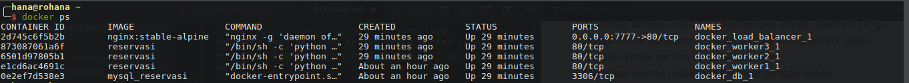
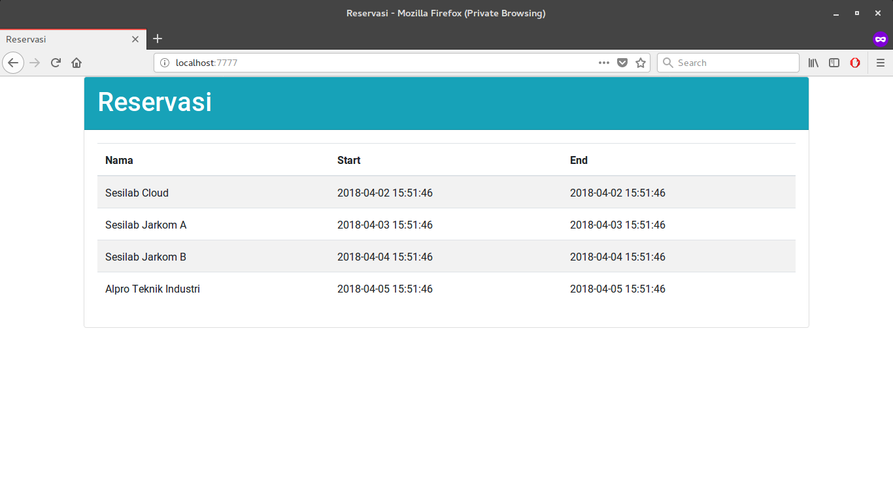

# Penyelesaian Tugas 3

1. Membuat Dockerfile untuk nomor 1 dan 4

__Dockerfile Nomor 1__
```dockerfile
FROM ubuntu:16.04

RUN apt update && apt install -y wget apt-utils zip python2.7 python-pip
RUN apt install -y libmysqlclient-dev
RUN pip install --upgrade pip

RUN wget https://cloud.fathoniadi.my.id/reservasi.zip && unzip reservasi.zip

WORKDIR reservasi
RUN pip install -r req.txt

CMD python server.py

EXPOSE 80
```

Buat image dengan menggunakan perintah 
`docker build -t reservasi`


__Dockerfile Nomor 4__
```dockerfile
FROM mysql:5.7

ENV MYSQL_ROOT_PASSWORD xyz

ENV MYSQL_USER userawan
ENV MYSQL_PASSWORD buayakecil
ENV MYSQL_DATABASE reservasi

COPY ./reservasi.sql /docker-entrypoint-initdb.d
```

Buat image dengan perintah
`docker build -t mysql_reservasi`

2. Membuat `docker-compose.yml`. Di sini kami menggunakan IP static untuk database, worker, dan juga load balancer.
```yml
version: '3'

services:
  worker1:
    depends_on:
      - db
    image: reservasi
    restart: always
    environment:
      DB_HOST: 172.20.0.25
      DB_USERNAME: userawan
      DB_PASSWORD: buayakecil
      DB_NAME: reservasi
    networks:
      docker1:
        ipv4_address: 172.20.0.24
  
  worker2:
    depends_on:
      - db
    image: reservasi
    restart: always
    environment:
      DB_HOST: 172.20.0.25
      DB_USERNAME: userawan
      DB_PASSWORD: buayakecil
      DB_NAME: reservasi
    networks:
      docker1:
        ipv4_address: 172.20.0.23
  
  worker3:
    depends_on:
      - db
    image: reservasi
    restart: always
    environment:
      DB_HOST: 172.20.0.25
      DB_USERNAME: userawan
      DB_PASSWORD: buayakecil
      DB_NAME: reservasi
    networks:
      docker1:
        ipv4_address: 172.20.0.22

  load_balancer:
    image: nginx:stable-alpine
    depends_on:
      - worker1
      - worker2
      - worker3
    ports:
      - 7777:80
    volumes: 
      - ./nginx.conf:/etc/nginx/conf.d/default.conf:ro
    networks:
      docker1:
        ipv4_address: 172.20.0.21

  db:
    image: mysql_reservasi
    restart: always
    networks:
      docker1:
        ipv4_address: 172.20.0.25

volumes:
  reservasi:

networks:
  docker1:
    ipam:
      config:
        - subnet: 172.20.0.0/24
```

Penjelasan:
- Membuat service untuk 3 worker dengan image reservasi yang sudah dibuat pada poin 1. Service untuk setiap worker akan berjalan ketika service db sudah berjalan.
- Membuat service untuk load balancer dengan image `nginx:stable-alpine`. Service load balancer akan berjalan ketika semua worker sudah berjalan. Load balancer menggunakan konfigurasi berikut:
```
upstream worker {
   server 172.20.0.22;
   server 172.20.0.23;
   server 172.20.0.24;
}

server {
        listen 80 default_server;
        location / {
                proxy_pass http://worker;
        }
}
```

- Membuat service untuk db dengan image mysql_reservasi yang sudah dibuat pada poin 1.

3. Lakukan perintah `docker-compose up -d` untuk menjalankan docker compose yang sudah dibuat pada poin 2. Berikut adalah container yang berjalan setelah melakukan perintah `docker-compose`:




4. Cek pada browser

