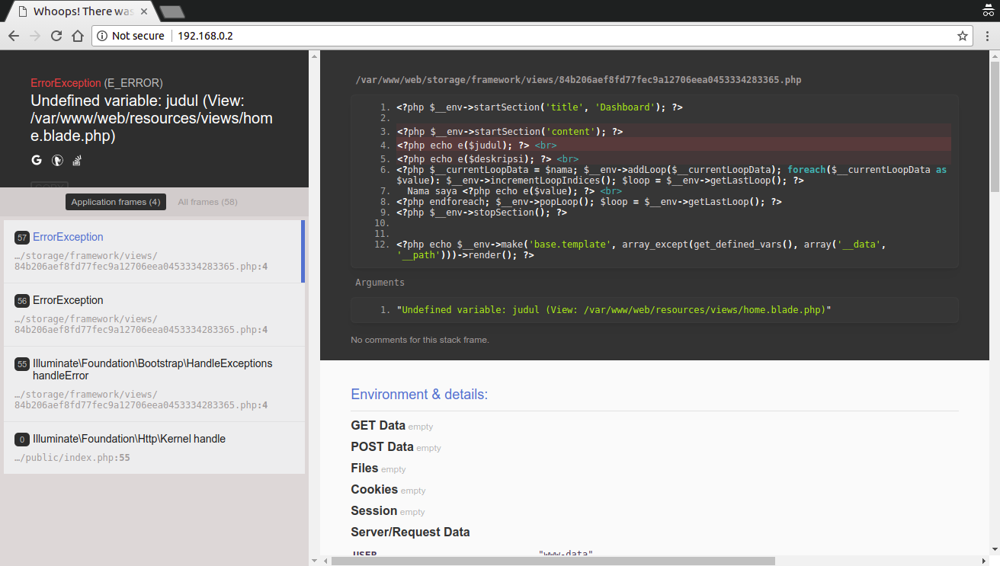

# Tugas Sesi Lab Modul 1

1. Semua *provisioning script* di bawah dilakukan dengan tambahan konfigurasi `privileged: false`
2. Vagrant box yang digunakan untuk soal 1, 2, dan 4 adalah `hashicorp/precise64`, sedangkan untuk nomor 3 menggunakan `bento/ubuntu-16.04`

__SOAL 1__

Buat vagrant virtualbox dan buat user 'awan' dengan password 'buayakecil'

__JAWAB__

Untuk menambahkan *user* pada Ubuntu dapat dilakukan dengan perintah `useradd` atau `adduser`. Perbedaannya adalah `adduser` secara *default* membuat direktori *home* bagi *user* tsb, sedangkan `useradd` tidak. Pada kasus ini kami menggunakan perintah `adduser`. Masalah yang dihadapi ketika membuat *user* adalah (1) harus memasukkan *password* dan (2) [GECOS field](https://en.wikipedia.org/wiki/Gecos_field), yaitu informasi tambahan seputar nama lengkap, alamat, dll, keduanya tanpa mengetikkannya secara manual ketika diminta oleh proses. Oleh karena itu *provisioning script* yang kami gunakan adalah seperti berikut:

```bash
echo -e "buayakecil\nbuayakecil\n" | sudo adduser --gecos "" awan
```

Masalah (1) diselesaikan dengan melakukan `echo`. Karena *password* akan diminta dua kali, maka kami menggunakan opsi `-e` agar `\n` dapat diinterpretasikan sebagai *enter*. Perintah ini kemudian di-*pipe* dengan `adduser`. Masalah (2) diselesaikan dengan menambahkan opsi `--gecos` yang pada dokumentasi `adduser` memungkinkan kita untuk memasukkan informasi pada GECOS field lebih dulu sehingga nanti tidak diminta lagi. Berikut ini hasil yang didapat ketika menjalankan *provisioning*:


__SOAL 2__

Buat vagrant virtualbox dan lakukan provisioning install Phoenix Web Framework

__JAWAB__

Script provisioning:

```bash
# Dependensi utama untuk Framework Phoenix adalah elixir dan erlang
wget https://packages.erlang-solutions.com/erlang-solutions_1.0_all.deb && sudo dpkg -i erlang-solutions_1.0_all.deb
sudo apt-get update
sudo apt-get install elixir esl-erlang -y

# Memastikan UTF8 sebagai native name encoding
sudo update-locale LC_ALL=en_US.UTF-8

# Setelah melakukan instalasi elixir, perlu juga menginstall Hex package manager
# Karena nantinya butuh konfirmasi, maka di-pipe dengan "yes"
yes | mix local.hex

# Install Phoenix archive
yes | mix archive.install https://github.com/phoenixframework/archives/raw/master/phx_new.ez

# Dependensi bagi OS Linux untuk live code reloading
sudo apt-get install inotify-tools -y
```

__SOAL 3__

Buat vagrant virtualbox dan lakukan provisioning install:
1. php
2. mysql
3. composer
4. nginx

Setelah melakukan provisioning, clone https://github.com/fathoniadi/pelatihan-laravel.git pada folder yang sama dengan vagrantfile di komputer host. Setelah itu sinkronisasi folder pelatihan-laravel host ke vagrant ke **/var/www/web** dan jangan lupa install vendor laravel agar dapat dijalankan. Setelah itu setting root document nginx ke **/var/www/web**. webserver VM harus dapat diakses pada port 8080 komputer host dan mysql pada vm dapat diakses pada port 6969 komputer host

__JAWAB__
Script provisioning:
```bash
#!/bin/bash
echo "Starting provision..."
sudo apt-get update
sudo apt-get install -y zip unzip python-software-properties software-properties-common curl git

# MySQL Installation
sudo debconf-set-selections <<< "mysql-server mysql-server/root_password password cloud"
sudo debconf-set-selections <<< "mysql-server mysql-server/root_password_again password cloud"
sudo apt-get install -y mysql-server

# Creating the Database
mysql -u root -pcloud -e "CREATE DATABASE cloud;"
mysql -u root -pcloud -e "CREATE USER 'root'@'%' IDENTIFIED BY 'cloud';"
mysql -u root -pcloud -e "GRANT ALL PRIVILEGES ON *.* TO 'root'@'%';"
mysql -u root -pcloud -e "FLUSH PRIVILEGES;"

# Adding PHP Repository
sudo add-apt-repository -y ppa:ondrej/php
sudo apt-get update

# PHP Installation
sudo apt-get install php7.1 php7.1-xml php7.1-mbstring php7.1-mysql php7.1-json php7.1-curl php7.1-cli php7.1-common php7.1-mcrypt php7.1-gd libapache2-mod-php7.1 php7.1-zip

# Composer Installation
curl -sS https://getcomposer.org/installer | php
sudo mv composer.phar /usr/local/bin/composer

# Nginx Installations
sudo apt-get install -y nginx
```

Setelah melakukan provisioning, sinkronisasi folder __pelatihan-laravel__ host ke vagrant __/var/www/web__ dengan mengedit file Vagrantfile dan menambahkan:
```ruby
config.vm.synced_folder "pelatihan-laravel/", "/var/www/web", id: "vagrant-root",
	owner: "vagrant",
	group: "www-data",
	mount_options: ["dmode=775,fmode=664"]
```

Pada file __/etc/nginx/sites-available/default__, konfigurasinya diedit sehingga menjadi:
```
server {
    # Server listening port
    listen 80;

    # Server domain or IP
    server_name localhost;

    # Root and index files
    root /var/www/web/public;
    index index.php index.html index.htm;

    # Urls to attemp
    location / {
        try_files $uri $uri/ /index.php?$query_string;
    }

    # Configure PHP FPM
    location ~* \.php$ {
        fastcgi_pass unix:/var/run/php/php7.1-fpm.sock;
        fastcgi_index index.php;
        fastcgi_split_path_info ^(.+\.php)(.*)$;
        fastcgi_params SCRIPT_FILENAME $document_root$fastcgi_script_name;
        include /etc/nginx/fastcgi_params;
    }
}
```

Setelah itu jalankan `service nginx restart` dan `service php7.1-fpm restart`. Setelah melakukan restart pada web server, pindah ke direktori __/var/www/web__ dan jalankan `composer install`.

Setelah menjalankan `composer install` copykan file __.env.example__ dan ubah namanya menjadi __.env__ pada folder yang sama. Kemudian sesuaikan konfigurasi dalam file __.env__ sesuai nama database, user, dan password yang sudah ditentukan sewaktu provisioning install. Kemudian jalankan `php artisan key:generate` lalu `php artisan migrate`.

Untuk mengecek apakah konfigurasi sudah benar, akses pada browser IP Private yang sebelumnya sudah ditentukan pada Vagrantfile.



__Note:__
Aplikasi Web yang disediakan memang error sehingga pada browser akan muncul seperti gambar di atas.

__SOAL 4__

Buat vagrant virtualbox dan lakukan provisioning install:
1. Squid Proxy
2. Bind9

__JAWAB__

Untuk melakukan provisioning install Squid Proxy dan Bind9:

```
sudo apt-get update
sudo apt-get install -y squid3
sudo apt-get install -y bind9
```


Untuk mengecek apakah Squid Proxy dan Bind9 sudah terinstall pada Virtual Machine, ketikkan perintah _service squid3 status_ dan _service bind9 status_, bila keduanya sudah running maka Squid Proxy dan Bind9 sudah terinstall pada Virtual Machine.

