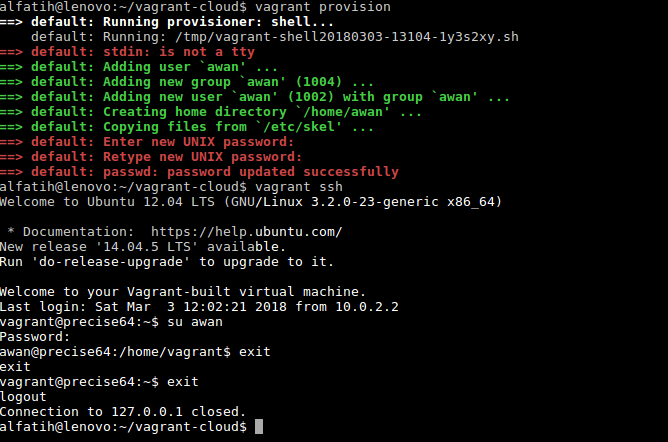
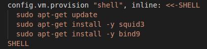
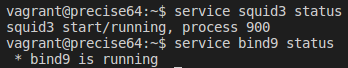

# Tugas Sesi Lab Modul 1

Semua *provisioning script* di bawah dilakukan dengan tambahan konfigurasi `privileged: false`

__SOAL__

1. Buat vagrant virtualbox dan buat user 'awan' dengan password 'buayakecil'

__JAWAB__

Untuk menambahkan *user* pada Ubuntu dapat dilakukan dengan perintah `useradd` atau `adduser`. Perbedaannya adalah `adduser` secara *default* membuat direktori *home* bagi *user* tsb, sedangkan `useradd` tidak. Pada kasus ini kami menggunakan perintah `adduser`. Masalah yang dihadapi ketika membuat *user* adalah (1) harus memasukkan *password* dan (2) [GECOS field](https://en.wikipedia.org/wiki/Gecos_field), yaitu informasi tambahan seputar nama lengkap, alamat, dll, keduanya tanpa mengetikkannya secara manual ketika diminta oleh proses. Oleh karena itu *provisioning script* yang kami gunakan adalah seperti berikut:

```
echo -e "buayakecil\nbuayakecil\n" | sudo adduser --gecos "" awan
```

Masalah (1) diselesaikan dengan melakukan `echo`. Karena *password* akan diminta dua kali, maka kami menggunakan opsi `-e` agar `\n` dapat diinterpretasikan sebagai *enter*. Perintah ini kemudian di-*pipe* dengan `adduser`. Masalah (2) diselesaikan dengan menambahkan opsi `--gecos` yang pada dokumentasi `adduser` memungkinkan kita untuk memasukkan informasi pada GECOS field lebih dulu sehingga nanti tidak diminta lagi. Berikut ini hasil yang didapat ketika menjalankan *provisioning*:



__SOAL__

2. Buat vagrant virtualbox dan lakukan provisioning install Phoenix Web Framework

__JAWAB__

Script provisioning:

```
# Dependensi utama untuk Framework Phoenix adalah elixir dan erlang
wget https://packages.erlang-solutions.com/erlang-solutions_1.0_all.deb && sudo dpkg -i erlang-solutions_1.0_all.deb
sudo apt-get update
sudo apt-get install elixir esl-erlang -y

# Memastikan UTF8 sebagai native name encoding
sudo update-locale LC_ALL=en_US.UTF-8

# Setelah melakukan instalasi elixir, perlu juga menginstall Hex package manager
mix local.hex

# Install Phoenix archive
mix archive.install https://github.com/phoenixframework/archives/raw/master/phx_new.ez

# Dependensi bagi OS Linux untuk live code reloading
sudo apt-get install inotify-tools -y
```

__SOAL__

3. Buat vagrant virtualbox dan lakukan provisioning install:
	1. php
	2. mysql
	3. composer
	4. nginx
	
	Setelah melakukan provisioning, clone https://github.com/fathoniadi/pelatihan-laravel.git pada folder yang sama dengan vagrantfile di komputer host. Setelah itu sinkronisasi folder pelatihan-laravel host ke vagrant ke **/var/www/web** dan jangan lupa install vendor laravel agar dapat dijalankan. Setelah itu setting root document nginx ke **/var/www/web**. webserver VM harus dapat diakses pada port 8080 komputer host dan mysql pada vm dapat diakses pada port 6969 komputer host

__SOAL__

4. Buat vagrant virtualbox dan lakukan provisioning install:
	1. Squid Proxy
	2. Bind9

__JAWAB__

Untuk melakukan provisioning install Squid Proxy dan Bind9, :

```
sudo apt-get update
sudo apt-get install -y squid3
sudo apt-get install -y bind9
```



Untuk mengecek apakah Squid Proxy dan Bind9 sudah terinstall pada Virtual Machine, ketikkan perintah _service squid3 status_ dan _service bind9 status_, bila keduanya sudah running maka Squid Proxy dan Bind9 sudah terinstall pada Virtual Machine.

